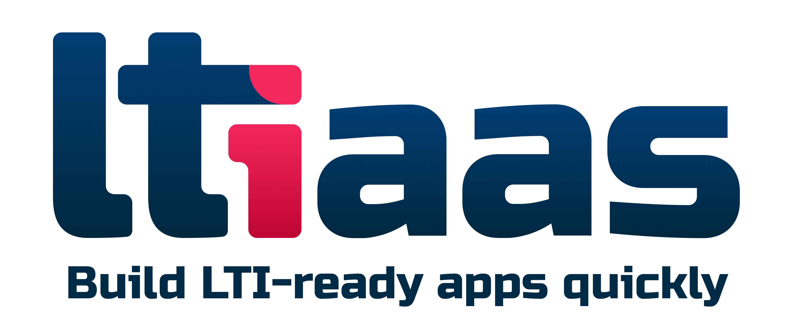
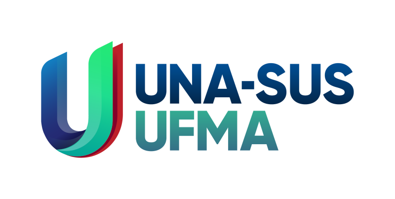
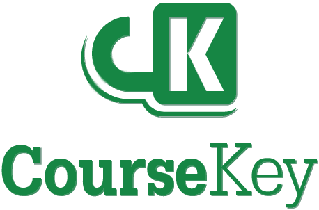

<div align="center">
  <a href="https://github.com/Cvmcosta/ltijs"></a>
</div>

> Easily turn your web application into a LTI® 1.3 Learning Tool.

[](https://www.npmjs.com/package/ltijs)
[](https://www.npmjs.com/package/ltijs)
[](https://www.npmjs.com/package/ltijs)
[](https://github.com/Cvmcosta/ltijs/blob/master/LICENSE)

> **v7 is a full rewrite**, with a new, TypeScript-first `Provider` class. Coming from an earlier version?
> See [Migrating from ltijs v5](https://cvmcosta.me/ltijs/#/guides/migrating-from-v5), or the
> [Legacy docs](https://cvmcosta.me/ltijs/#/legacy-docs) for the full v5 and earlier documentation.

The Learning Tools Interoperability (LTI®) protocol is a standard for integrating rich learning
applications within educational environments ([spec](https://www.imsglobal.org/spec/lti/v1p3/)). ltijs
implements a full LTI® 1.3 tool provider, including launches, Deep Linking, Assignment and Grade Services,
Names and Role Provisioning, and Dynamic Registration, as a pluggable, TypeScript-first library. You get a
working learning tool without implementing any of the underlying security and validation yourself.

## Quick start

```bash
npm install ltijs
```

```ts
import { Provider } from 'ltijs'

const provider = new Provider({
  database: { url: 'mongodb://localhost/ltijs' },
})

provider.onResourceLink(async (context, request, response) => {
  response.html(`Hello, ${context.idToken.user.name ?? 'learner'}!`)
})

await provider.listen()
```

Continue with [Getting Started](https://cvmcosta.me/ltijs/#/guides/getting-started) for the full
walkthrough, including registering a platform.

## Documentation

Full documentation lives at **[cvmcosta.me/ltijs](https://cvmcosta.me/ltijs)**:

- **[Guides](https://cvmcosta.me/ltijs/#/guides/getting-started)**: walkthroughs for setting up a Provider,
  handling launches, and using every LTI 1.3 service ltijs supports.
- **[API Reference](https://cvmcosta.me/ltijs/#/api/README)**: every exported class, method, and type ltijs ships.

## LTI As A Service

<div align="center">
	<a href="https://ltiaas.com"></img></a>
</div>

> A ready-to-go SaaS LTI solution.

If you need an enterprise-ready LTI deployment, [LTIaaS](https://ltiaas.com) can get you up and running in
minutes. It's a SaaS solution with a powerful API giving you access to the entire LTI protocol, with
consultation services available to help design, build, and maintain your tool.

## Contributing

Please star us on [GitHub](https://github.com/Cvmcosta/ltijs), it always helps!

If you find a bug or think something is hard to understand, feel free to open an issue or contact
[@cvmcosta](https://twitter.com/cvmcosta) on Twitter. Pull requests are welcome too.

If you feel like it, you can also support the project directly:

<a href="https://www.buymeacoffee.com/UL5fBsi" target="_blank"></a>

## Special thanks

<div align="center">
	<a href="https://portais.ufma.br/PortalUfma/" target="_blank"></img></a>
  <a href="https://www.unasus.ufma.br/" target="_blank"></img></a>
</div>

> Thank you to the Federal University of Maranhão and UNA-SUS/UFMA for the support throughout the entire
> development process.

<div align="center">
	<a href="https://coursekey.com/" target="_blank"></img></a>
</div>

> Thank you to CourseKey for making the certification process possible and for the IMS membership through
> them, which contributed immensely to the future of the project.

<div align="center">
	<a href="https://www.examind.io/" target="_blank"></img></a>
</div>

> Thank you to Examind for the work on the Firestore database plugin, and for the continuous help and
> support in the development of this project.

## License

[](https://github.com/Cvmcosta/ltijs/blob/master/LICENSE)

ltijs is released under the [Apache-2.0](https://github.com/Cvmcosta/ltijs/blob/master/LICENSE) license.

> *Learning Tools Interoperability® (LTI®) is a trademark of the IMS Global Learning Consortium, Inc.
> (https://www.imsglobal.org)*
