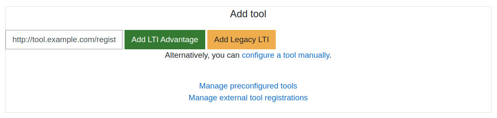

<div align="center">
	<br>
	<br>
	<a href="https://cvmcosta.github.io/ltijs"></img></a>
  <a href="https://site.imsglobal.org/certifications/coursekey/ltijs"​ target='_blank'></img></a>
</div>


> Dynamic Registration Service


[](https://codecov.io/gh/Cvmcosta/ltijs)
[](https://www.npmjs.com/package/ltijs)
[](https://www.npmjs.com/package/ltijs)
[](https://www.npmjs.com/package/ltijs)
[](https://standardjs.com)
[](#LICENSE)
[](https://www.buymeacoffee.com/UL5fBsi)

## Table of Contents

- [Introduction](#introduction)
- [Usage](#usage)
- [Documentation](#documentation)
- [License](#license)

---


## Introduction

Ltijs is the first LTI library to implement the **Dynamic Registration Service**. 

Dynamic registration turns the LTI registration flow into a fast, completely automatic process. Ltijs exposes a registration endpoint through which Platforms can initiate the registration flow.

Currently the following LMSs support Dynamic Registration:

| **LMS** | **Version** |
| ---- | ---|
| Moodle | ^3.10 |


---


## Usage


### Setting up dynamic registration

Dynamic registration needs to be setup through the `Provider.setup` method with the `options.dynReg` and `options.dynRegRoute` fields.

- **dynRegRoute**: Dynamic registration route. Defaults to `/register`.

- **dynReg**: Dynamic registration configuration object. **The service is disabled if this object is not present in the setup options.**
  - **url**: Tool Provider URL. Required field. Example: `http://tool.example.com`.
  - **name**: Tool Provider name. Required field. Example: `Tool Provider`.
  - **logo**: Tool Provider logo URL. Example: `http://tool.example.com/assets/logo.svg`.
  - **description**: Tool Provider description.
  - **redirectUris**: Additional redirection URLs. The main URL is added by default. Example: `['http://tool.example.com/launch']`.
  - **customParameters**: Custom parameters. Example `{ key: 'value' }`.
  - **autoActivate**: Determines whether or not dynamically registered Platforms should be automatically activated. Defaults to `false`.
  - **useDeepLinking**: Deep Linking usage flag. If `true`, sets up deep linking in the platform. Defaults to `true`.

**Example:**

``` javascript
// Require Provider 
const lti = require('ltijs').Provider

// Setup provider
lti.setup('LTIKEY', // Key used to sign cookies and tokens
  { // Database configuration
    url: 'mongodb://localhost/database',
    connection: { user: 'user', pass: 'password' }
  },
  { // Options
    appRoute: '/', loginRoute: '/login', // Optionally, specify some of the reserved routes
    cookies: {
      secure: false, // Set secure to true if the testing platform is in a different domain and https is being used
      sameSite: '' // Set sameSite to 'None' if the testing platform is in a different domain and https is being used
    },
    devMode: true, // Set DevMode to false if running in a production environment with https
    dynRegRoute: '/register', // Setting up dynamic registration route. Defaults to '/register'
    dynReg: {
      url: 'http://tool.example.com', // Tool Provider URL. Required field.
      name: 'Tool Provider', // Tool Provider name. Required field.
      logo: 'http://tool.example.com/assets/logo.svg', // Tool Provider logo URL.
      description: 'Tool Description', // Tool Provider description.
      redirectUris: ['http://tool.example.com/launch'], // Additional redirection URLs. The main URL is added by default.
      customParameters: { key: 'value' }, // Custom parameters.
      autoActivate: false // Whether or not dynamically registered Platforms should be automatically activated. Defaults to false.
    }
  }
)
```


### Using the Dynamic Registration Service

Dynamic Registration is used when a Platform makes a **registration request** to the Tool's **dynamic registration endpoint**, *`/register` by default*. Both parties will then exchange information and create the registrations.

Platform registrations created dynamically, by default, have to be manually activated. This can be done by using the `Platform.platformActive` method:


```javascript
// Retrieve Platform
const platform = await lti.getPlatform('http://platform.example.com', 'CLIENTID')
// Activate Platform
await platform.platformActive(true)
```

By setting the `options.dynReg.autoActivate` field to `true` in the `Provider.setup` method, dynamically registered Platforms can be automatically activated.

#### Custom flow

The Dynamic Registration flow can be customized by using the `lti.onDynamicRegistration` method. This method allows us to control the registration flow to add additional screens, for example.

The registration can be finalized by calling the `lti.DynamicRegistration.register` method passing the necessary query parameters and then appending the resulting message to the page HTML.

The following example is a representation of the default Dynamic Registration flow:

```javascript
lti.onDynamicRegistration(async (req, res, next) => {
  try {
    if (!req.query.openid_configuration) return res.status(400).send({ status: 400, error: 'Bad Request', details: { message: 'Missing parameter: "openid_configuration".' } })
    const message = await lti.DynamicRegistration.register(req.query.openid_configuration, req.query.registration_token)
    res.setHeader('Content-type', 'text/html')
    res.send(message)
  } catch (err) {
    if (err.message === 'PLATFORM_ALREADY_REGISTERED') return res.status(403).send({ status: 403, error: 'Forbidden', details: { message: 'Platform already registered.' } })
    return res.status(500).send({ status: 500, error: 'Internal Server Error', details: { message: err.message } })
  }
})
```


### Moodle LMS

Follow the steps bellow to use the Dynamic Registration Service with the Moodle LMS:

- Go to `Site administration / Plugins / Activity modules / External tool / Manage tools`.

- Fill the `Tool URL` field with your Tool's registration URL. Example: `http://tool.example.com/register`.

- Click `Add LTI Advantage`.

<div align="center">
  </br>
	</img>
  <div><sub>Dynamic Registration with Moodle</sub></div>
  </br>
</div>


---

## License

[](LICENSE)
