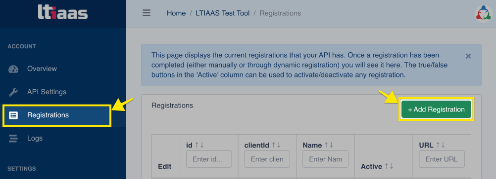
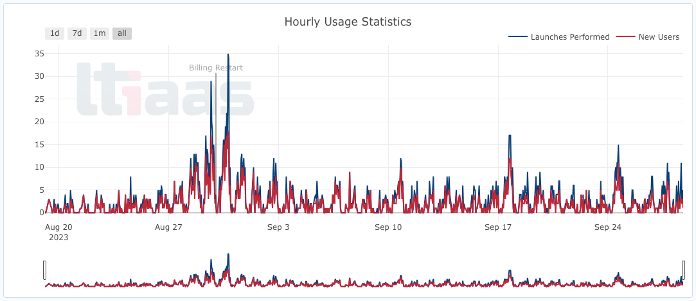
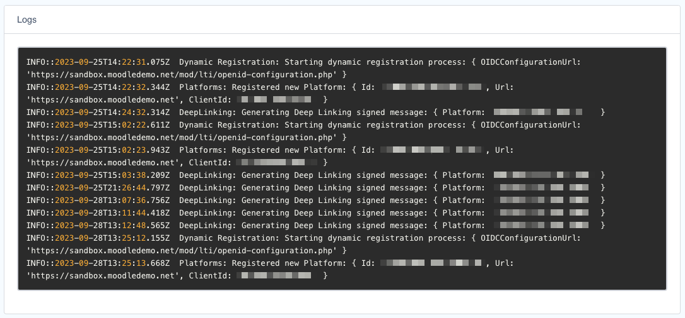

	<a href="https://ltiaas.com"></img></a>
   
   

# LTIJS Vs. LTIAAS

LTIJS is a Node.js library that allows anyone with a background in Node.js, Linux, and databases to host their own private LTI server. [LTIAAS](https://ltiaas.com) (or LTI As A Service), takes away the complexity of hosting your own LTI server and adds new features not found in LTIJS.

LTIAAS has the following advantages over LTIJS:
- Quicker updates to new LTI features and protocol changes.
- LTIAAS is a hosted service, so there is no need to worry about keeping a database and server up and running, keeping software up to date, or managing security and compliance.
- Several API enhancements over LTIJS

| Feature                   |  |  |
| ------------------------- | ----- | ------ |
| Core Launch               | ✅    | ✅     |
| Names And Roles           | ✅    | ✅     |
| Assignment And Grades     | ✅    | ✅     |
| Deep Linking              | ✅    | ✅     |
| Dynamic Registration      | ✅    | ✅     |
| Asynchronous Service Keys | ⬜️   | ✅     |
| Admin Interface           | ⬜️   | ✅     |
| Professional Support      | ⬜️   | ✅     |
| Multiple Tools            | ⬜️   | ✅     |
| Future API Services      | ⬜️     | ✅       |

## Asynchronous Service Keys

Typically, LTIJS tokens expire in 24 hours. This means that if you want to make LTI API calls (like sending grades), these calls have to be made within 24 hours of a user login. LTIAAS has a new feature called [Asynchronous Service Keys](https://ltiaas.com/guides/api/async) that solves this problem. A [Service Key](https://ltiaas.com/guides/api/authentication#service-key-based-authentication) is a non-expiring authentication token created by LTIAAS that allows certain LTI request to be made asynchronously to an active user session. This enables things like periodic roster syncing and offline grade submissions.

## Admin interface

LTIAAS automates a lot of the manual tasks required by LTI, such as:

### LMS Registration

Instead of manually managing LMS registrations with API calls in LTIJS, LTIAAS gives you an interface to manage LMS registrations.

   
	</img>
  
LTIAAS Portal registrations page with add registration button highlighted

   

### Usage Statistics

Track the growth of your tool over time and even receive emails on API errors.

   
	</img>
  
Example LTIAAS usage statistics graph

   

### Logs For Easy Debug
Debug your integration with easy to read logs.

   
	</img>
  
Example LTIAAS debug logs

   

## Professional Support

LTIJS support is limited to the GitHub community's responses and involvement, whereas LTIAAS has a professional support staff in-house. LTIAAS even offers consulting services ranging from simple integration support to custom projects and development.

## Multiple Accounts

One LTIJS server can only support a single LTI tool. If you want to have a separate development and production server, or if you are developing more than one tool, LTIAAS allows you to have multiple accounts without the added complexity of managing multiple servers. This can be a major cost savings over managing multiple servers and databases.