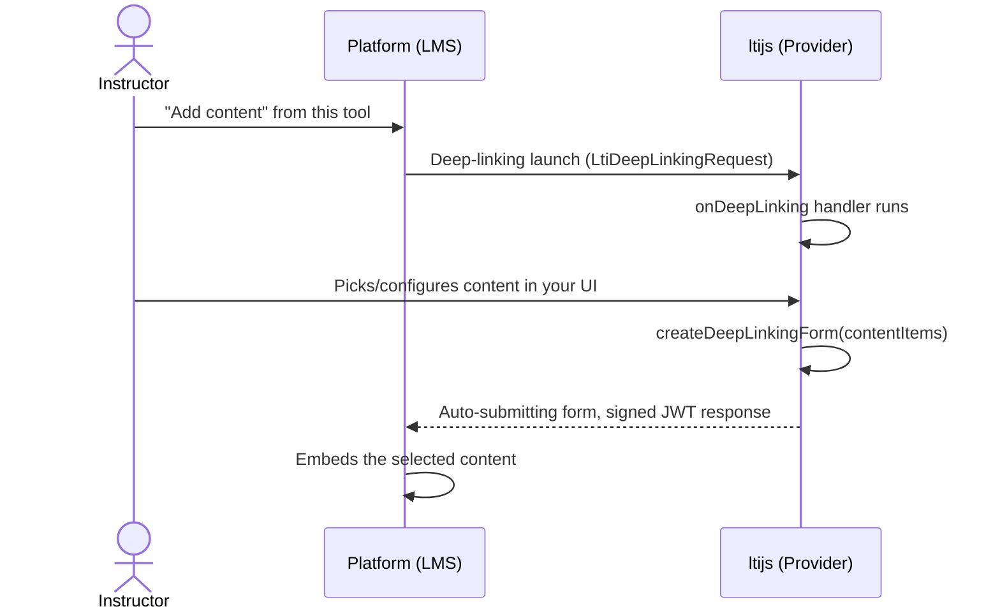

# Deep Linking

Deep Linking lets an instructor pick or configure content inside your tool, then send their selection
back to the platform to be embedded in a course.

See the [Deep Linking API reference](../api/services.md#deep-linking) for the full method list, and
[Deep Linking types](../api/services.md#deep-linking-types) for the `ContentItem`/`DeepLinkingOptions`
shapes.



A deep-linking launch dispatches to `provider.onDeepLinking`, just like a resource-link launch dispatches
to `onResourceLink` (see [Handling Launches](handling-launches.md)). From there, build a response once
the instructor has made their selection:

```ts
provider.onDeepLinking(async (context, request, response) => {
  const contentItems = [
    {
      type: 'ltiResourceLink',
      title: 'Week 1 Reading',
      url: 'https://your-tool.example.com/launch?resource=week-1',
    },
  ]

  const form = await context.deepLinking.createDeepLinkingForm(contentItems)
  response.html(form)
})
```

`createDeepLinkingForm` returns a full auto-submitting HTML form, the response your route should send
directly. `createDeepLinkingMessage` returns just the signed JWT, if you want to build the response
yourself. Content items are only loosely validated (`type` is required; everything else follows the
[LTI Deep Linking spec](https://www.imsglobal.org/spec/lti-dl/v2p0) for whichever `type` you use, be it
`link`, `file`, `html`, `image`, or `ltiResourceLink`).

## Options

```ts
await context.deepLinking.createDeepLinkingForm(contentItems, {
  message: 'Content added successfully', // shown to the instructor on return
  errMessage: 'Something went wrong', // set instead of `message` to signal failure
  log: 'debug info for the platform', // not shown to the user
})
```

If the platform sent a `data` claim in the original launch, it's echoed back automatically. Most
platforms require this to correlate the response with the request.
