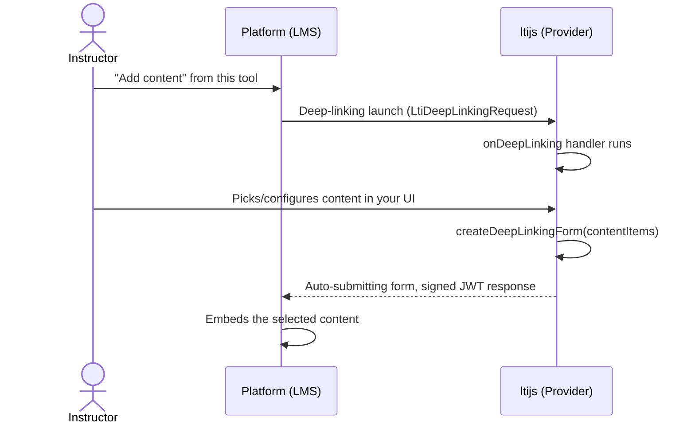

# Deep Linking

Deep Linking lets an instructor pick or configure content inside your tool, then send their selection
back to the platform to be embedded in a course. `context.deepLinking` is only available on a
deep-linking launch, so it's already safe to use unconditionally inside `onDeepLinking` (the dispatch that
routed you there guarantees it), but check `context.deepLinking.isAvailable()` first if you're calling it
from anywhere else, such as `onResourceLink`:

```ts
if (!context.deepLinking.isAvailable()) {
  response.status(400).json({ error: 'This launch does not support Deep Linking.' })
  return
}
```

Both `createDeepLinkingMessage`/`createDeepLinkingForm` throw `MissingDeepLinkSettingsError` if called on
a non-deep-linking launch, so `isAvailable()` lets you handle that up front instead of catching it.

See the [Deep Linking API reference](../api/services.md#deep-linking) for the full method list, and
[Deep Linking types](../api/services.md#deep-linking-types) for the `ContentItem`/`DeepLinkingOptions`
shapes.



A deep-linking launch dispatches to `provider.onDeepLinking`, just like a resource-link launch dispatches
to `onResourceLink` (see [Handling Launches](handling-launches.md)). From there, build a response once
the instructor has made their selection:

```ts
provider.onDeepLinking(async (context, request, response) => {
  const contentItems = [
    {
      type: 'ltiResourceLink',
      title: 'Week 1 Reading',
      url: 'https://your-tool.example.com/launch?resource=week-1',
    },
  ]

  const form = await context.deepLinking.createDeepLinkingForm(contentItems)
  response.html(form)
})
```

`createDeepLinkingForm` returns a full auto-submitting HTML form, the response your route should send
directly. `createDeepLinkingMessage` returns just the signed JWT, if you want to build the response
yourself. Content items are only loosely validated (`type` is required; everything else follows the
[LTI Deep Linking spec](https://www.imsglobal.org/spec/lti-dl/v2p0) for whichever `type` you use, be it
`link`, `file`, `html`, `image`, or `ltiResourceLink`).

## An interactive content picker

The example above builds the response immediately, as if the selection were already known. In practice an
instructor usually needs to interact with a picker UI first, so the response can't be sent from inside the
original `onDeepLinking` handler at all: it has to come from wherever that picker submits to, on a
separate request. Render the picker from `onDeepLinking`, carrying `context.ltik` along so that follow-up
request can rebuild the same context:

```ts
provider.onDeepLinking(async (context, request, response) => {
  response.html(`
    <form method="POST" action="/deep-linking/submit">
      <input type="hidden" name="ltik" value="${context.ltik}" />
      <label><input type="radio" name="resource" value="week-1" /> Week 1 Reading</label>
      <label><input type="radio" name="resource" value="week-2" /> Week 2 Reading</label>
      <button type="submit">Add to course</button>
    </form>
  `)
})
```

The picker's own submit route resumes the launch via `getLaunchContext`, then builds and sends the actual
deep-linking response from there:

```ts
const app = provider.httpHandler.app

app.post('/deep-linking/submit', async (req, res) => {
  const context = await provider.getLaunchContext(req.body.ltik)

  const contentItems = [
    {
      type: 'ltiResourceLink',
      title: `Week ${req.body.resource === 'week-1' ? '1' : '2'} Reading`,
      url: `https://your-tool.example.com/launch?resource=${req.body.resource}`,
    },
  ]

  const form = await context.deepLinking.createDeepLinkingForm(contentItems)
  res.send(form)
})
```

See [Adding regular routes](handling-launches.md#adding-regular-routes) for the two ways to register that
submit route, and [Retrieving launch information](handling-launches.md#retrieving-launch-information) for
more on `ltik`.

## Options

```ts
await context.deepLinking.createDeepLinkingForm(contentItems, {
  message: 'Content added successfully', // shown to the instructor on return
  errMessage: 'Something went wrong', // set instead of `message` to signal failure
  log: 'debug info for the platform', // not shown to the user
})
```

If the platform sent a `data` claim in the original launch, it's echoed back automatically. Most
platforms require this to correlate the response with the request.
