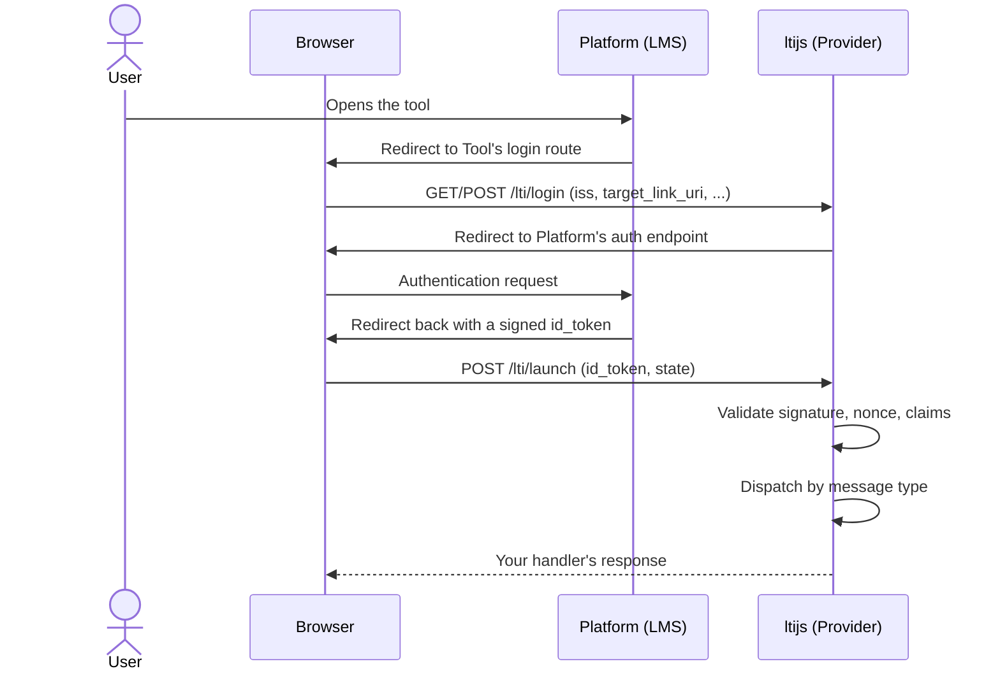

# Handling Launches



A launch always starts at the login route and ends at the launch route, a few redirects later (the
`sameSite: 'none'` state cookie plus a local-storage recovery step, not shown above, keeps this working
even when third-party cookies are blocked). Once the id_token is validated, ltijs dispatches to one of
three handlers based on the LTI message type:

```ts
provider.onResourceLink(async (context, request, response) => { /* the common case */ })
provider.onDeepLinking(async (context, request, response) => { /* content-selection launches */ })
provider.onSubmissionReview(async (context, request, response) => { /* instructor reviewing a submission */ })

provider.onConnect(handler) // alias of onResourceLink, for anyone migrating from legacy ltijs
```

Every handler gets three arguments: the resolved `LaunchContext`, and the raw request/response, for
reading extra headers/cookies or sending something other than the default. If you don't set a handler,
the default sends `200 It works!`. That's useful while wiring things up, but not something to ship.

## `LaunchContext`

See the [`LaunchContext` API reference](../api/launch-context.md#launchcontext) for every field, and
[`IdToken`](../api/launch-context.md#idtoken) for the full shape of `context.idToken`.

```ts
provider.onResourceLink(async (context) => {
  context.idToken // this launch's claims, as ltijs's own IdToken shape
  context.platform // the Platform this launch came from
  context.ltik // opaque token identifying this launch, see below
  context.contextId // shorthand for the underlying id_token record's id

  context.grading // Assignment and Grade Services, see the Grading guide
  context.deepLinking // Deep Linking service, see the Deep Linking guide
  context.namesAndRoles // Names and Role Provisioning Service, see the Names and Roles guide
})
```

> **Legacy compatibility**
>
> `context.legacyIdToken` reshapes the id_token into the flat, snake_case-heavy structure legacy ltijs
> returned. It's deprecated; prefer `context.idToken` in new code.

## Retrieving launch information

`ltik` is a signed, opaque token identifying the launch. Protecting a custom route, or submitting a grade
from a background job outside the original request, both need it:

```ts
app.get('/my-custom-route', async (req, res) => {
  const context = await provider.getLaunchContext(req.query.ltik)
  // ...
})
```

See [`getLaunchContext`](../api/provider.md#getlaunchcontextltik) in the API reference.

## Unregistered or inactive platforms

If a login arrives from a platform that isn't registered, or is registered but deactivated, ltijs sends a
JSON error response by default. Override either via `ProviderOptions` (see
[Configuring a Provider](configuring-a-provider.md#unregistered-inactive-platforms)) or:

```ts
provider.onUnregisteredPlatform(async (request, response) => { /* ... */ })
provider.onInactivePlatform(async (request, response) => { /* ... */ })
```
