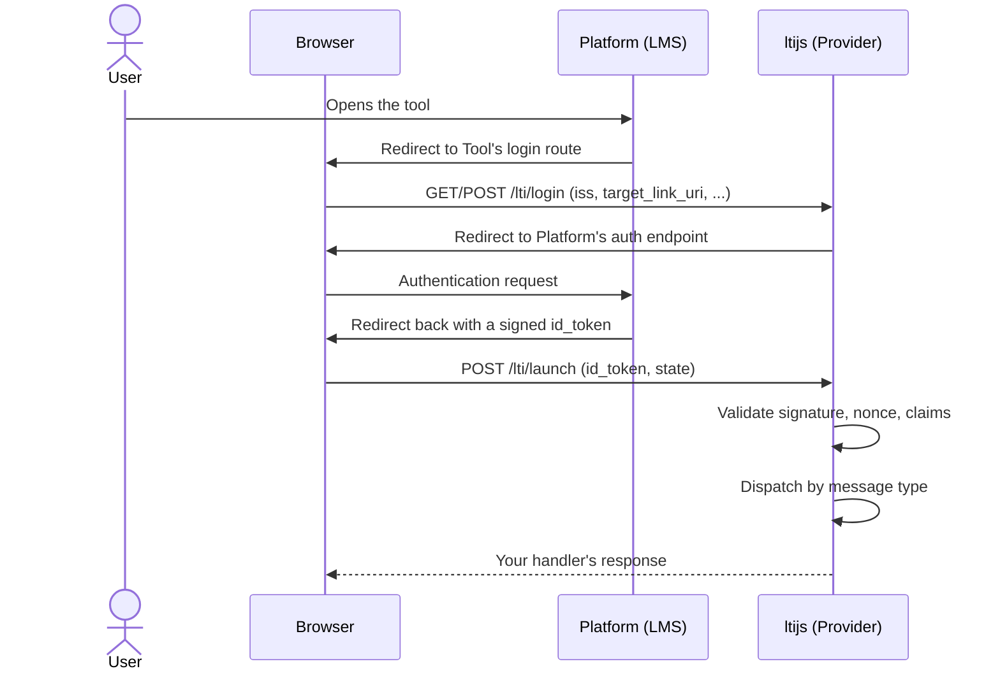

# Handling Launches



A launch always starts at the login route and ends at the launch route, a few redirects later. ltijs never
sets a cookie for this round trip: a `localStorage`-based recovery step (not shown above) is the primary
mechanism, and it falls back to the official LTI Advantage postMessage storage handshake for platforms
that declare support for it, in case `localStorage` itself doesn't round-trip inside the platform's iframe.
Once the id_token is validated, ltijs dispatches to one of three handlers based on the LTI message type:

```ts
provider.onResourceLink(async (context, request, response) => { /* the common case */ })
provider.onDeepLinking(async (context, request, response) => { /* content-selection launches */ })
provider.onSubmissionReview(async (context, request, response) => { /* instructor reviewing a submission */ })

provider.onConnect(async (context, request, response) => { /* alias of onResourceLink, for anyone migrating from legacy ltijs */ })
```

Every handler gets three arguments: the resolved `LaunchContext`, and a `request`/`response` pair. If you
don't set a handler, the default sends `200 It works!`. That's useful while wiring things up, but not
something to ship.

## `LaunchContext`

See the [`LaunchContext` API reference](../api/launch-context.md#launchcontext) for every field, and
[`IdToken`](../api/launch-context.md#idtoken) for the full shape of `context.idToken`.

```ts
provider.onResourceLink(async (context, request, response) => {
  context.idToken // this launch's claims, as ltijs's own IdToken shape
  context.platform // the Platform this launch came from
  context.ltik // opaque token identifying this launch, see below
  context.contextId // shorthand for the underlying id_token record's id

  context.grading // Assignment and Grade Services, see the Grading guide
  context.deepLinking // Deep Linking service, see the Deep Linking guide
  context.namesAndRoles // Names and Role Provisioning Service, see the Names and Roles guide
})
```

> **Legacy compatibility**
>
> `context.legacyIdToken` reshapes the id_token into the flat, snake_case-heavy structure legacy ltijs
> returned. It's deprecated; prefer `context.idToken` in new code.

## `request` and `response`

These aren't the underlying framework's own request/response objects: they're ltijs's own
`HttpRequestParameters`/`HttpResponse` shapes, the same ones every `HttpHandler` implementation works
with, so a handler behaves identically no matter which one is active (Express by default).

```ts
provider.onResourceLink(async (context, request, response) => {
  request.method // 'POST'
  request.path // '/lti/launch', or whichever route matched
  request.query // query params, merged from the URL
  request.headers // request headers, lowercased names
  request.body // the parsed request body

  response.status(201).json({ ok: true }) // pick one of these three
  // response.html('<p>Hello!</p>') // or this
  // response.redirect('https://example.com') // or this
})
```

Call exactly one of `response.json`/`.html`/`.redirect`; each fully sends the response itself, and none of
them call the next handler in a chain the way a framework's own middleware might. `status()` is the
exception: it just sets the status code and returns `response`, so it chains onto whichever of the three
you call. See the full [`HttpRequestParameters`/`HttpResponse` reference](../api/backends.md#httphandler)
for every field and method.

## Retrieving launch information

`ltik` (`context.ltik`) is a signed, opaque token identifying the launch. Protecting a custom route, or
submitting a grade from a background job outside the original request, both need it:

```ts
const app = provider.httpHandler.app

app.get('/my-custom-route', async (req, res) => {
  const context = await provider.getLaunchContext(req.query.ltik)
  // ...
})
```

See [`getLaunchContext`](../api/provider.md#getlaunchcontextltik) in the API reference, and
[Adding regular routes](#adding-regular-routes) below for the two ways to actually register a route like
this one.

## Adding LTI Launch routes

A login request's `target_link_uri` becomes the `redirect_uri` ltijs asks the platform to send the
id_token back to, and that URI can point anywhere within your tool, not just at the default launch route:
a deep-linked resource, for example, can carry its own `target_link_uri` for a specific item. If a
platform sends its launch to a path ltijs never registered a handler for, that request 404s. Register any
extra path you expect launches to land on with `registerLtiRoute`:

```ts
provider.registerLtiRoute('/assignment/:id')
```

It runs the exact same validation and dispatches through the same `onResourceLink`/`onDeepLinking`/
`onSubmissionReview` handlers as the default launch route, not a separate set. A handler that needs to
behave differently depending on which route it was reached through can read `request.path` itself.

## Adding regular routes

A route that isn't part of the LTI launch flow, resuming a launch via `getLaunchContext`, protecting an
app route, or anything else your tool needs, can be added two ways:

- **Through the framework directly.** ltijs never gets in the way of the underlying framework: a plain
  route registered the framework's own way works exactly as it would in any app built on it, and calling
  `getLaunchContext` from inside it is just a regular async call, no special wiring required.

  ```ts
  const app = provider.httpHandler.app

  app.get('/my-custom-route', async (req, res) => {
    const context = await provider.getLaunchContext(req.query.ltik)
    // ...
  })
  ```

  This only works with an `HttpHandler` that exposes its underlying framework instance: `ExpressHttpHandler.app`
  does. See [`HttpHandler`](../api/backends.md#httphandler) for constructing one yourself first, so you
  have a properly-typed reference to it.

- **Through `registerRoute()`.** Portable across whichever `HttpHandler` is active, using the `request`/
  `response` shapes [described above](#request-and-response):

  ```ts
  provider.httpHandler.registerRoute('/my-custom-route', [HttpMethod.Get], async (request, response) => {
    const context = await provider.getLaunchContext(request.query.ltik)
    // ...
  })
  ```

  Use this if you'd rather not depend on which framework is behind `HttpHandler`, or if you're on a
  custom `HttpHandler` implementation that doesn't expose an underlying framework instance at all.

## Unregistered or inactive platforms

If a login arrives from a platform that isn't registered, or is registered but deactivated, ltijs sends a
JSON error response by default. Override either via `ProviderOptions` (see
[Configuring a Provider](configuring-a-provider.md#unregistered-inactive-platforms)) or:

```ts
provider.onUnregisteredPlatform(async (request, response) => { /* ... */ })
provider.onInactivePlatform(async (request, response) => { /* ... */ })
```
