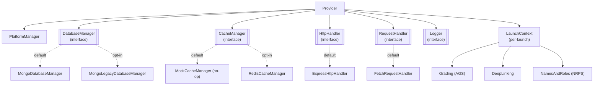

# Philosophy & Architecture

v7 was designed around three goals: a **simplified API** that's easier and more intuitive to use, a **less
opinionated design** that does what it needs to do without forcing additional things on you, and **much
greater customizability**, giving you a lot of flexibility in how you build with ltijs.

The first two show up throughout the public API: setup is `new Provider(options)`, a launch handler, and
`listen()`; every service on `context` (`context.grading`, `context.namesAndRoles`, `context.deepLinking`)
is already scoped to the current launch, with no id_token or access token to look up and pass around
yourself; and ltijs never dictates your database, HTTP framework, logging setup, or how the rest of your
application is structured, it sits inside your app rather than being the app.

The third comes down to one idea: **every external dependency is a small, swappable interface, with a
sensible default already wired in.** You can go from `npm install` to a running tool with nothing but a
database URL. Later on you can swap any single piece (storage, caching, the HTTP framework, even how
outbound requests are made) without touching the rest.

## The pieces

- **`Provider`**: the object you construct. It wires everything below together and exposes the routes,
  handlers, and sub-services you interact with.
- **`DatabaseManager`**: reads and writes platforms, access tokens, id tokens, and OIDC nonces. Defaults
  to MongoDB (`MongoDatabaseManager`, built in). `MongoLegacyDatabaseManager` is an opt-in alternative that
  reads the schema ltijs v4/v5 used, for migrating an existing deployment without a data migration. See
  [Swapping Backends](swapping-backends.md).
- **`CacheManager`**: an optional layer for caching platform JWKS responses and the served keyset.
  Defaults to a no-op, so nothing is cached. A per-process in-memory cache can't stay consistent across
  multiple ltijs instances behind a load balancer, so "cache nothing" is the only default that's always
  correct regardless of deployment topology. `RedisCacheManager` is opt-in and gives every instance a
  shared, coordinated cache.
- **`HttpHandler`**: the HTTP framework adapter. Defaults to Express. Implement this interface to run
  ltijs on top of Fastify, Koa, a serverless handler, or anything else.
- **`RequestHandler`**: how ltijs makes *outbound* HTTP requests, to a platform's token endpoint, JWKS,
  or AGS/NRPS services. Defaults to the built-in `fetch`.
- **`Logger`**: where debug output goes. Defaults to `console`-based logging.
- **`LaunchContext`**: not swappable, but central. It's constructed fresh for every launch and it's what
  your handlers actually work with (see [Handling Launches](handling-launches.md)).

For the exact interface signatures behind `DatabaseManager`, `CacheManager`, `HttpHandler`,
`RequestHandler`, and `Logger`, see the [Backends API reference](../api/backends.md).

## Why this shape

Every one of the interfaces above is small and focused: `CacheManager` is five methods, `DatabaseManager`
is a dozen. That's deliberate. Implementing your own is meant to be a reasonable afternoon's work, not a
project. If you only need to override one thing (say, logging), you only implement `Logger` and pass it in
`ProviderOptions.logger`. Everything else keeps its default.

This also means the defaults are never special-cased internally. `MongoDatabaseManager`,
`ExpressHttpHandler`, and `MockCacheManager` are ordinary implementations of the same interfaces you'd
implement yourself; nothing about `Provider`'s own logic knows or cares which implementation it was
handed.
