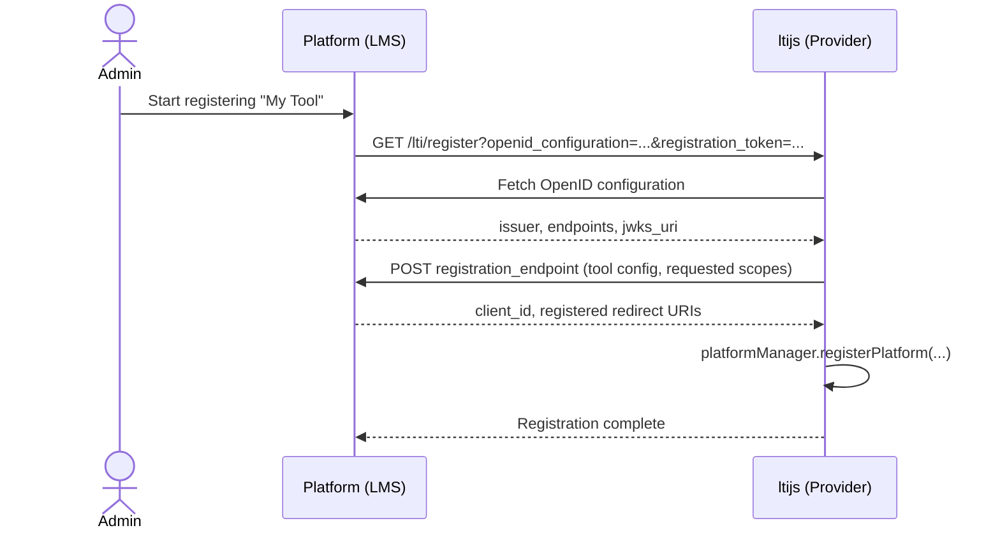

# Registering Platforms

An LMS (a "platform", in LTI terms) can only launch your tool once it's registered. ltijs needs its
issuer URL, client ID, auth/token endpoints, and a way to verify the platform's signed requests. All of
this goes through `provider.platformManager`.

## Configuring your tool in the LMS

Registration goes both ways: as well as telling ltijs about the LMS (below), most LMS's need you to
manually add your tool through their own "add external tool" screen. The URLs they ask for map directly
to ltijs's routes, which default to:

| ltijs route | Default URL | What the LMS usually calls it |
| --- | --- | --- |
| Login route | `https://your-tool.example.com/lti/login` | OIDC Login URL / Initiate Login URL |
| Launch route | `https://your-tool.example.com/lti/launch` | Redirect URI(s) / Target Link URI |
| Keyset route | `https://your-tool.example.com/lti/keys` | Public JWK URL / Keyset URL |

These come from `ProviderOptions.routes` (see [Configuring a Provider](configuring-a-provider.md)) -- if
you've overridden any of them, use your own values instead of the defaults shown above. Most LMS's also
generate a **client ID** at this point, which you'll need when calling `registerPlatform()` below.

If your LMS supports it, [Dynamic Registration](#dynamic-registration) automates this entire exchange
instead of filling in these fields by hand.

## Registering

```ts
const platform = await provider.platformManager.registerPlatform({
  url: 'https://platform.example.com',
  clientId: 'your-client-id',
  name: 'Example LMS',
  authenticationEndpoint: 'https://platform.example.com/auth',
  accessTokenEndpoint: 'https://platform.example.com/token',
  idTokenValidation: { method: IdTokenValidationMethod.JwkSet, key: 'https://platform.example.com/jwks' },
})
```

`registerPlatform` generates the tool's own RSA keypair for this platform and throws if the `url`+`clientId`
pair is already registered. `idTokenValidation.method` is one of three ways to verify a platform's signed
id_tokens: `JwkSet` (fetch the platform's JWKS endpoint, most common), `JwkKey` (a single JWK given up
front), or `RsaKey` (a raw PEM key).

See the [Platform Manager API reference](../api/platform-manager.md#methods) for the full method list,
and [`PlatformRegistrationInput`](../api/platform-manager.md#platformregistrationinput) for every field
`registerPlatform` accepts.

## Looking platforms up

```ts
await provider.platformManager.getPlatforms() // all platforms
await provider.platformManager.getPlatforms({ url: 'https://platform.example.com' }) // filtered
await provider.platformManager.getPlatformById(platformId)
await provider.platformManager.getPlatformByUrlAndClientId(url, clientId) // what a login request resolves against
```

## Updating, activating, and key rotation

```ts
await provider.platformManager.updatePlatform(platform, { name: 'New Name' })
await provider.platformManager.deactivatePlatform(platform) // login/launch requests are rejected until reactivated
await provider.platformManager.activatePlatform(platform)
await provider.platformManager.rotateKeys(platform) // fresh RSA keypair; the old key stops being served immediately
await provider.platformManager.deletePlatform(platform)
```

> **Legacy compatibility**
>
> `Platform` retains a few deprecated fields (`publicKey`, `privateKey`, `authConfig`, `accesstokenEndpoint`)
> and `PlatformManager` retains `getAllPlatforms`/`getPlatform` as aliases of `getPlatforms`/
> `getPlatformByUrlAndClientId`, kept as a v5-migration bridge. New code should prefer `keys.public`/
> `keys.private`/`idTokenValidation`/`accessTokenEndpoint` and `getPlatforms`/`getPlatformByUrlAndClientId`.
> See the [API Reference](../api/platform-manager.md#platform) for the full list.

## Dynamic Registration

Rather than registering platforms by hand, an LMS administrator can register your tool interactively. The
platform drives the exchange; your tool just needs to expose a registration endpoint. See
[`DynamicRegistrationOptions`](../api/services.md#dynamic-registration) in the API reference for every
config field.

```ts
new Provider({
  dynamicRegistration: {
    name: 'My Tool',
    url: 'https://your-tool.example.com',
    autoActivate: false, // default: newly registered platforms start deactivated
    useDeepLinking: true, // default: advertise deep-linking support
  },
})
```



By default, a newly dynamically-registered platform is created **deactivated** (`autoActivate: false`),
so you can review it and call `activatePlatform` before it can be launched. Override the entire flow with
`onDynamicRegistration`, or call `getOpenIDConfiguration`/`performRegistration` yourself for full control:

```ts
provider.onDynamicRegistration(async (request, response) => {
  const config = await provider.dynamicRegistrationService.getOpenIDConfiguration(
    request.query.openid_configuration,
  )
  const platform = await provider.dynamicRegistrationService.performRegistration(config, request.query.registration_token, {
    autoActivate: true,
  })
  response.html(provider.dynamicRegistrationService.FINALIZE_REGISTRATION_HTML_SNIPPET)
})
```
